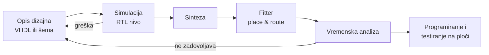

## 1. Uvod u FPGA tehnologiju

**Video:** [Uvod u FPGA tehnologiju](https://www.youtube.com/watch?v=oJSAv1hhdgk) (22:26) · **Kod:** - · **Vezana uputstva:** [Instalacija alata](../tools-setup.md), [Simulacija i testiranje](../simulation-and-testing.md), [Video tutorijali](../video-tutorials.md)

### Sadržaj

| Vrijeme | Tema |
| ---: | ------ |
| [00:11](https://www.youtube.com/watch?v=oJSAv1hhdgk&t=11s) | Šta je FPGA: logički blokovi, programabilne veze, ulazno-izlazni blokovi |
| [00:59](https://www.youtube.com/watch?v=oJSAv1hhdgk&t=59s) | Logički blok: *lookup* tabela (LUT), multiplekseri, D flip-flop |
| [01:59](https://www.youtube.com/watch?v=oJSAv1hhdgk&t=119s) | Programabilne međuveze i komutacione matrice |
| [02:58](https://www.youtube.com/watch?v=oJSAv1hhdgk&t=178s) | Ulazno-izlazni (I/O) blokovi |
| [03:49](https://www.youtube.com/watch?v=oJSAv1hhdgk&t=229s) | Arhitektura čipa Cyclone V |
| [06:47](https://www.youtube.com/watch?v=oJSAv1hhdgk&t=407s) | *Logic Array Block* (LAB) i međuveze |
| [08:12](https://www.youtube.com/watch?v=oJSAv1hhdgk&t=492s) | *Adaptive Logic Module* (ALM) |
| [10:21](https://www.youtube.com/watch?v=oJSAv1hhdgk&t=621s) | *Quartus Prime Lite* i *Chip Planner* |
| [12:43](https://www.youtube.com/watch?v=oJSAv1hhdgk&t=763s) | Proces projektovanja: opis dizajna |
| [14:07](https://www.youtube.com/watch?v=oJSAv1hhdgk&t=847s) | Simulacija |
| [15:17](https://www.youtube.com/watch?v=oJSAv1hhdgk&t=917s) | Sinteza |
| [16:49](https://www.youtube.com/watch?v=oJSAv1hhdgk&t=1009s) | *Fitter*: razmještanje i povezivanje |
| [17:42](https://www.youtube.com/watch?v=oJSAv1hhdgk&t=1062s) | Vremenska analiza |
| [19:10](https://www.youtube.com/watch?v=oJSAv1hhdgk&t=1150s) | Programiranje i testiranje na ploči |
| [20:23](https://www.youtube.com/watch?v=oJSAv1hhdgk&t=1223s) | Zaključak |

### Ključni pojmovi

- **FPGA** (*Field-Programmable Gate Array*) - integrisano kolo sa unaprijed projektovanim logičkim blokovima i vezama čija se funkcija i povezanost konfigurišu prema potrebama korisnika.
- **LUT** (*lookup* tabela) - mala SRAM memorija u kojoj je upisana tablica istinitosti logičke funkcije; ulazi funkcije biraju upisanu vrijednost.
- **Programabilne međuveze** - linije i komutacione matrice (prekidači kontrolisani SRAM ćelijama) koje povezuju logičke blokove.
- **I/O blok** - veza FPGA sa spoljnim svijetom (pinovi); podržava stanje visoke impedanse i podešavanje izlazne struje.
- **ALM** (*Adaptive Logic Module*) - osnovni logički element Cyclone V čipa: LUT-ovi, sabirači, multiplekseri i četiri flip-flopa.
- **LAB** (*Logic Array Block*) - grupa ALM-ova povezanih brzim lokalnim vezama.
- **Ugrađena memorija i DSP blokovi** - namjenski blokovi za memoriju opšte namjene i za digitalnu obradu signala (hardverski množači).
- **Sinteza** - prevođenje opisa dizajna u minimizovane logičke funkcije mapirane na tehnologiju FPGA (LUT-ove i ALM-ove).
- **Fitter** (*place & route*) - smještanje rezultata sinteze na konkretne lokacije u čipu i njihovo povezivanje.
- **Vremenska analiza** - procjena kašnjenja signala na osnovu rasporeda i veza, radi provjere vremenskih zahtjeva.

### Objašnjenje

#### Opšta struktura FPGA

FPGA je organizovana kao matrica logičkih blokova. Logički blok sadrži LUT (SRAM u kojoj je upisana tablica istinitosti), multipleksere i D flip-flop na izlazu, pa može da realizuje proizvoljnu kombinacionu funkciju sa registrovanim ili neregistrovanim izlazom. Blokovi se povezuju programabilnim vezama: komutacione matrice sadrže prekidače kontrolisane SRAM ćelijama, kojima se spajaju ili razdvajaju linije. Na obodu čipa su I/O blokovi koji povezuju unutrašnju logiku sa pinovima; mogu da postave izlaz u stanje visoke impedanse i da podese strujni kapacitet izlaza.

#### Cyclone V

Na kursu se koristi čip Cyclone V (proizvođač Altera; u videu je pomenut kao Intel FPGA). Osim logičkih blokova (ALM), čip sadrži brze primopredajnike (*transceivers*), PLL-ove za generisanje takt signala, *hard IP* blokove (npr. PCI Express i kontrolere eksterne memorije), ugrađene memorijske blokove, DSP blokove sa hardverskim množačima i dvojezgreni procesor ARM Cortex-A9 (HPS). Na kursu se koristi samo programabilni (FPGA) dio čipa.

Logički blokovi su grupisani u LAB-ove, unutar kojih su ALM-ovi povezani brzim lokalnim vezama, dok globalne veze povezuju LAB-ove međusobno. Jedan ALM sadrži LUT-ove kojima se mogu realizovati dvije šestoulazne logičke funkcije, sabirače za efikasnu realizaciju aritmetike i četiri flip-flopa. Izlazni multiplekseri biraju da li izlaz ide kroz flip-flop (sekvencijalna logika) ili ga zaobilazi (kombinaciona logika).

#### Proces projektovanja

1. **Opis dizajna** - tekstualno, jezikom za opis hardvera (na kursu VHDL), ili šematski.
2. **Simulacija** - provjera funkcionalne ispravnosti, najčešće na RTL nivou bez vremenskih parametara. Uspješna simulacija ne garantuje ispravan rad u svim uslovima, ali potvrđuje da dizajn funkcionalno zadovoljava specifikaciju.
3. **Sinteza** - prevođenje opisa u logičke funkcije, njihova minimizacija i mapiranje na tehnologiju. Kod FPGA to znači mapiranje na LUT-ove i ALM-ove, zato je za razumijevanje sinteze važno poznavati arhitekturu čipa.
4. **Fitter** - razmještanje (*placement*) logike na konkretne ALM-ove i povezivanje (*routing*) u skladu sa zadatim ograničenjima.
5. **Vremenska analiza** - kada je poznat raspored i povezanost, procjenjuju se kašnjenja i kritične putanje. Simulacija sa vremenskim parametrima je moguća, ali za složene dizajne previše zahtjevna, pa se koristi vremenska analiza.
6. **Programiranje i testiranje** - generisani konfiguracioni fajl se učitava u FPGA na razvojnoj ploči i dizajn se testira na stvarnom hardveru.

Ako neki korak pokaže da dizajn ne zadovoljava specifikaciju (funkciju, performanse, potrošnju ili zauzeće resursa), vraća se na izmjenu opisa ili podešavanja alata.

### Primjer

Raspored dizajna u čipu može se pogledati u alatu *Quartus Prime Lite*:

1. Otvorite ili napravite projekat i pokrenite kompletno prevođenje (**Processing &rarr; Start Compilation**), kako bi *Fitter* rasporedio logiku.
2. Otvorite **Tools &rarr; Chip Planner**. Prikazuje se nacrt čipa (*floor plan*); blokovi koje koristi dizajn obojeni su drugačije od slobodnih.
3. Zumiranjem se vide pojedinačni LAB-ovi i ALM-ovi, a vertikalne kolone su memorijski i DSP blokovi. Izborom bloka prikazuje se njegov opis i iskorišćenost.
4. U izvještaju o prevođenju (*Compilation Report*) pogledajte koliko je ALM-ova, registara, memorijskih i DSP blokova iskorišćeno.

Uporedite iskorišćenost i raspored za mali kombinacioni dizajn (npr. iz [videa 2](../video-tutorials.md)) i za dizajn sa registrima.

### Česte greške

- **Shvatanje VHDL-a kao programskog jezika**: opis se ne izvršava naredbu po naredbu, već se sintetiše u hardver (LUT-ove, flip-flopove i veze).
- **Preskakanje simulacije** i odmah testiranje na ploči: greške se teško lociraju na hardveru, a simulacija ih otkriva ranije i jeftinije.
- **Uspješna simulacija shvaćena kao dokaz ispravnosti**: RTL simulacija ne obuhvata kašnjenja; vremenski zahtjevi se provjeravaju vremenskom analizom.
- **Zanemarivanje izvještaja nakon prevođenja**: upozorenja sinteze i *Fitter*-a, iskorišćenost resursa i vremenska analiza govore da li dizajn odgovara specifikaciji.

### Provjera znanja

1. Od kojih elemenata se sastoji opšta FPGA arhitektura i kako se konfiguriše funkcija logičkog bloka?
2. Kako LUT realizuje logičku funkciju i koliko vrijednosti treba da sadrži LUT za funkciju šest promjenljivih?
3. Koji su osnovni elementi ALM-a u čipu Cyclone V i kako se bira da li je izlaz kombinacioni ili registrovan?
4. Po čemu se razlikuju sinteza i *Fitter*?
5. Zašto se kod složenih dizajna umjesto simulacije sa vremenskim parametrima koristi vremenska analiza?

Odgovori

1. Od matrice logičkih blokova, programabilnih međuveza (komutacionih matrica) i I/O blokova na obodu; funkcija se konfiguriše upisom vrijednosti u SRAM ćelije (LUT-ove i prekidače).
2. LUT čuva tablicu istinitosti u SRAM memoriji, a ulazne promjenljive preko multipleksera biraju upisanu vrijednost; za šest promjenljivih potrebno je 2^6 = 64 vrijednosti.
3. LUT-ovi (dvije šestoulazne funkcije), sabirači, multiplekseri i četiri flip-flopa; izlazni multiplekser bira da li signal ide kroz flip-flop ili ga zaobilazi.
4. Sinteza prevodi opis u minimizovane funkcije mapirane na vrstu resursa (LUT-ove, ALM-ove), a *Fitter* ih smješta na konkretne lokacije u čipu i povezuje.
5. Simulacija sa vremenskim parametrima zahtijeva previše računarskih resursa; vremenska analiza statički procjenjuje kašnjenja i kritične putanje za sve putanje odjednom.

### Dodatni materijali

- Sljedeći video: [2. Osnove VHDL jezika (prvi dio)](https://www.youtube.com/watch?v=-5Q7YpQmU40)
- [4. Programiranje ciljne FPGA platforme](https://www.youtube.com/watch?v=D-kIoQWeO_E)
- [13. Vremenska analiza sinhronih digitalnih sistema](https://www.youtube.com/watch?v=DVF86jV4JMo)
- [Video tutorijali](../video-tutorials.md) - pregled svih videa
