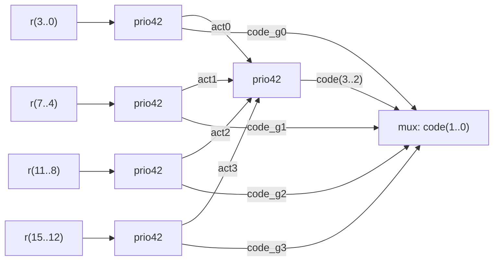

## 8. Optimizacija kombinacionih mreža

**Video:** [Optimizacija kombinacionih mreža](https://www.youtube.com/watch?v=hhH37OIjS3U) (56:38) · **Kod:** [`video-tutorials/part-2/video-tutorial-08`](../../video-tutorials/part-2/video-tutorial-08) · **Vezana uputstva:** [Video tutorijali](../video-tutorials.md)

### Sadržaj

| Vrijeme | Tema |
| ---: | ------ |
| [00:24](https://www.youtube.com/watch?v=hhH37OIjS3U&t=24s) | Optimizacija resursa i optimizacija brzine |
| [01:03](https://www.youtube.com/watch?v=hhH37OIjS3U&t=63s) | Dijeljenje operatora |
| [02:22](https://www.youtube.com/watch?v=hhH37OIjS3U&t=142s) | Primjer 1: `a + b` ili `a + c` |
| [07:54](https://www.youtube.com/watch?v=hhH37OIjS3U&t=474s) | Primjer 2: tri sabiranja u procesu |
| [14:21](https://www.youtube.com/watch?v=hhH37OIjS3U&t=861s) | Primjer 3: selekciona naredba |
| [16:49](https://www.youtube.com/watch?v=hhH37OIjS3U&t=1009s) | Primjer 4: dva izlaza, jedan sabirač |
| [20:45](https://www.youtube.com/watch?v=hhH37OIjS3U&t=1245s) | Dijeljenje funkcionalnosti |
| [21:32](https://www.youtube.com/watch?v=hhH37OIjS3U&t=1292s) | Sabirač-oduzimač |
| [26:19](https://www.youtube.com/watch?v=hhH37OIjS3U&t=1579s) | Komparator sa dva moda |
| [33:21](https://www.youtube.com/watch?v=hhH37OIjS3U&t=2001s) | Apsolutna razlika: bez komparatora |
| [39:13](https://www.youtube.com/watch?v=hhH37OIjS3U&t=2353s) | Aritmetička negacija umjesto drugog oduzimanja |
| [41:03](https://www.youtube.com/watch?v=hhH37OIjS3U&t=2463s) | Apsolutna razlika sa jednim oduzimačem |
| [43:28](https://www.youtube.com/watch?v=hhH37OIjS3U&t=2608s) | Komparator sa tri izlaza |
| [50:06](https://www.youtube.com/watch?v=hhH37OIjS3U&t=3006s) | Optimizacija kašnjenja: stablo umjesto kaskade |
| [51:10](https://www.youtube.com/watch?v=hhH37OIjS3U&t=3070s) | Prioritetni enkoder: kaskadna arhitektura |
| [53:01](https://www.youtube.com/watch?v=hhH37OIjS3U&t=3181s) | Prioritetni enkoder: stablo od enkodera 4 na 2 |

### Ključni pojmovi

- **Dijeljenje operatora** (*operator sharing*) - jedan skup operator (sabirač, komparator) koristi se za više operacija, a operandi se biraju multiplekserima.
- **Dijeljenje funkcionalnosti** (*functionality sharing*) - dio logike se koristi za više funkcija na osnovu poznavanja rada kola.
- **Drugi komplement** - zapis označenih brojeva; `a - b = a + not b + 1`.
- **Kaskadna struktura** - kola vezana redom jedno za drugim; kašnjenje raste linearno sa brojem ulaza.
- **Struktura stabla** - kola organizovana u nivoe; kašnjenje raste logaritamski.
- **ALM** (*Adaptive Logic Module*) - osnovni logički blok Cyclone V čipa; mjera zauzeća resursa u izvještaju o kompilaciji.

### Objašnjenje

Kod opisuje istu funkciju na više načina, a alat za sintezu uglavnom slijedi strukturu opisa. Zato oblik VHDL koda utiče na broj resursa i na kašnjenje. Rezultat se provjerava u *RTL Viewer*-u i u izvještaju o kompilaciji (*Logic utilization (in ALMs)*). Brojevi ALM-ova u nastavku su iz videa.

#### Dijeljenje operatora

Sabirač je skuplji od multipleksera (u ovoj tehnologiji ALM sadrži sabirač, pa ušteda ne mora biti vidljiva, ali uopšteno važi). Umjesto da se izračunaju oba zbira i izabere jedan, prvo se izabere operand, pa se sabira jednom ([`share_operator.vhd`](../../video-tutorials/part-2/video-tutorial-08/share_operator/share_operator.vhd)):

```vhdl
architecture direct_arch1 of share_operator is
begin
   r <= std_logic_vector(unsigned(a) + unsigned(b)) when ctrl='0' else
      std_logic_vector(unsigned(a) + unsigned(c));
end direct_arch1;

architecture shared_arch1 of share_operator is
  signal src0 : std_logic_vector(7 downto 0);
begin
   src0 <= b when ctrl='0' else
         c;
  r <= std_logic_vector(unsigned(a) + unsigned(src0));
end shared_arch1;
```

`direct_arch1` daje dva sabirača i multiplekser, a `shared_arch1` multiplekser i jedan sabirač. Isti princip važi za tri operacije (`a + b`, `a + c`, `d + 1`), bilo u procesu sa `if` bilo sa `with select`: multiplekseri biraju oba operanda (`src0`, `src1`), a sabiranje je jedno. Kada postoje dva izlaza (`x` i `y`), jedan zbir `sum` se računa van procesa, a proces bira operande i usmjerava `sum` na odgovarajući izlaz. Ove varijante su u fajlu zakomentarisane, jer koriste drugačiji entitet.

> **Napomena o grešci u videu:** U dijeljenoj verziji drugog primjera (`shared_arch2`, od [12:07](https://www.youtube.com/watch?v=hhH37OIjS3U&t=727s)) treći slučaj sabira `a` i 1, a direktna verzija računa `d + 1`, pa dvije arhitekture nisu ekvivalentne. Takođe, procesi u zakomentarisanim primjerima nisu imali `ctrl` (i `sum`) u listi osjetljivosti, iako se ti signali čitaju u procesu. Kod je ispravljen (`src0 <= unsigned(d);`, dopunjene liste osjetljivosti) i označen komentarima `NOTE`; ekvivalentnost svih arhitektura provjerena je simulacijom.

#### Sabirač-oduzimač

Oduzimanje u drugom komplementu je sabiranje sa invertovanim drugim operandom i dodatnom jedinicom: `a - b = a + not b + 1`. [`addsub.vhd`](../../video-tutorials/part-2/video-tutorial-08/addsub/addsub.vhd) zato koristi jedan sabirač, a jedinicu dodaje kroz najniži, dodatni bit oba operanda:

```vhdl
architecture shared_arch of addsub is
   signal src0, src1, sum: signed(8 downto 0);
   signal b_tmp: std_logic_vector(7 downto 0);
   signal cin: std_logic; -- carry-in bit
begin
   src0 <= signed(a & '1');
   b_tmp <= b when ctrl='0' else
            not b;
   cin <= '0' when ctrl='0' else
          '1';
   src1 <= signed(b_tmp & cin);
   sum <= src0 + src1;
   r <= std_logic_vector(sum(8 downto 1));
end shared_arch;
```

Najniži bit zbira je `1 + cin`: kada je `cin = '1'`, nastaje prenos u bit 1, što je isto kao dodavanje jedinice. Taj bit se odbacuje (`sum(8 downto 1)`).

#### Komparator sa dva moda

[`comp2mode.vhd`](../../video-tutorials/part-2/video-tutorial-08/comp2mode/comp2mode.vhd) poredi brojeve kao neoznačene (`mode = '0'`) ili označene (`mode = '1'`). Umjesto dva komparatora koristi se jedan, za nižih sedam bita, i logika za bit znaka:

```vhdl
architecture shared_arch of comp2mode is
signal a1_b0, agtb_mag: std_logic;
begin
   a1_b0 <= '1' when a(7)='1' and b(7)='0' else
            '0';
   agtb_mag <= '1' when a(6 downto 0) > b(6 downto 0) else
               '0';
   agtb <= agtb_mag when (a(7)=b(7)) else
           a1_b0 when mode='0' else
           not a1_b0;
end shared_arch;
```

Kada su najviši biti jednaki, odlučuju niži biti u oba moda. Kada se razlikuju, `a(7) = '1'` znači da je `a` veći neoznačen broj, ali negativan (manji) označen broj.

> **Napomena o grešci u videu:** Na [26:27](https://www.youtube.com/watch?v=hhH37OIjS3U&t=1587s) se kaže da prvi mod poredi označene, a drugi neoznačene brojeve. U kodu (i u objašnjenju na [32:00](https://www.youtube.com/watch?v=hhH37OIjS3U&t=1920s)) je obrnuto: `mode = '0'` poredi neoznačene, a `mode = '1'` označene brojeve.

#### Apsolutna razlika

[`diff.vhd`](../../video-tutorials/part-2/video-tutorial-08/diff/diff.vhd) računa `|a - b|` za neoznačene brojeve kroz četiri arhitekture:

| Arhitektura | Ideja | ALM (video) |
| ------ | ------ | :---: |
| `direct_arch` | dva oduzimanja i komparator `au >= bu` | 17 |
| `shared_arch` | operandi prošireni na 9 bita; znak razlike (`diffab(8)`) zamjenjuje komparator | 13 |
| `effi_arch` | kao `shared_arch`, ali `diffba <= 0 - diffab` (negacija umjesto drugog oduzimanja) | 9 |
| `shared3_arch` | komparator bira redoslijed operanada, jedno oduzimanje | 10 |

```vhdl
architecture effi_arch of diff is
   signal as, bs, rs, diffab, diffba: signed(8 downto 0);
begin
   as <= signed('0'&a);
   bs <= signed('0'&b);
   diffab <= as - bs;
   diffba <= 0 - diffab;
   rs <= diffab when diffab(8)='0' else
         diffba;
   result <= std_logic_vector(rs(7 downto 0));
end effi_arch;
```

Alat za sintezu sam ne prepoznaje da je `b - a = -(a - b)`; to mu treba reći opisom.

#### Komparator sa tri izlaza

Izlazi `agtb`, `altb` i `aeqb` su međusobno isključivi, pa se treći može izvesti iz druga dva. [`comp3.vhd`](../../video-tutorials/part-2/video-tutorial-08/comp3/comp3.vhd) ima tri arhitekture: tri komparatora (`direct_arch`), `>` i `<` sa `aeqb <= not (gt or lt)` (`share1_arch`, 17 ALM), i `=` i `<` sa `agtb <= not (eq or lt)` (`share2_arch`, 13 ALM). Poređenje jednakosti je jeftinije od poređenja po veličini, pa je `share2_arch` najbolja.

> **Napomena o grešci u videu:** Na [43:55](https://www.youtube.com/watch?v=hhH37OIjS3U&t=2635s) se kaže da su ulazi veličine 15 bita; `a` i `b` su 16-bitni (`15 downto 0`). Na [48:11](https://www.youtube.com/watch?v=hhH37OIjS3U&t=2891s) se kaže da je komparator „veće” najčešće jeftiniji; tačno je obrnuto, jeftiniji je komparator jednakosti, što potvrđuju i rezultati (13 prema 17 ALM-ova).

#### Optimizacija kašnjenja: stablo umjesto kaskade

Kaskadna struktura (kolo za kolom) ima kašnjenje proporcionalno broju nivoa; stablo ima mnogo manje nivoa. Prioritetni enkoder 16 na 4 ([`prio_encoder.vhd`](../../video-tutorials/part-2/video-tutorial-08/prio_encoder/prio_encoder.vhd)) opisan uslovnom naredbom (`cascade_arch`) daje lanac od 16 multipleksera. Arhitektura `tree_arch` koristi pet enkodera 4 na 2 ([`prio42.vhd`](../../video-tutorials/part-2/video-tutorial-08/prio_encoder/prio42.vhd)) u dva nivoa:



Prvi nivo kodira svaku grupu od četiri bita; drugi nivo bira grupu najvišeg prioriteta (`code(3 downto 2)`), a multiplekser bira niža dva bita koda iz te grupe:

```vhdl
   tmp <= act3 & act2 & act1 & act0;
   unit_level_2: prio42
      port map(r4=>tmp, code2=>code_msb,
               act42=>active);
   code(3 downto 2) <= code_msb;
   with code_msb select
      code(1 downto 0) <= code_g3 when "11",
                          code_g2 when "10",
                          code_g1 when "01",
                          code_g0 when others;
```

### Primjer

Folder [`video-tutorials/part-2/video-tutorial-08`](../../video-tutorials/part-2/video-tutorial-08) sadrži sve primjere; svaki fajl ima konfiguraciju (`<entitet>_cfg`) kojom se bira arhitektura. U *Quartus*-u:

1. Napravite projekat sa fajlom `diff.vhd` i postavite `diff_cfg` kao *top-level*.
2. Za svaku arhitekturu promijenite konfiguraciju, pokrenite kompletnu kompilaciju i zabilježite *Logic utilization (in ALMs)*; uporedite sa tabelom iznad.
3. Pogledajte *RTL Viewer* za `direct_arch` i `effi_arch`.

Vježba iz videa ([42:40](https://www.youtube.com/watch?v=hhH37OIjS3U&t=2560s)): spojite ideje `shared3_arch` i `shared_arch`, tako da se koristi jedno oduzimanje, a komparator zamijeni ispitivanjem znaka.

### Česte greške

- **Očekivanje da alat sam pronađe dijeljenje**: sinteza uglavnom prati opis; dijeljenje treba opisati eksplicitno.
- **Neekvivalentna optimizovana verzija**: nakon optimizacije provjerite simulacijom da obje arhitekture daju iste izlaze za sve ulaze.
- **Signal koji se čita u procesu nije u listi osjetljivosti** (npr. `ctrl`): simulacija ne odgovara sintezi.
- **Zanemarivanje tehnologije**: ušteda na RTL nivou ne znači uvijek manje ALM-ova; provjerite izvještaj o kompilaciji.
- **Kaskadni opis velikih uslovnih naredbi**: dugačak lanac multipleksera i veliko kašnjenje.

### Provjera znanja

1. Zašto `shared_arch1` koristi manje resursa od `direct_arch1` iako daje isti rezultat?
2. Kako sabirač-oduzimač realizuje oduzimanje jednim sabiračem?
3. Zašto `shared_arch` u `diff.vhd` ne treba komparator?
4. Zašto je za komparator sa tri izlaza bolje koristiti `=` i `<` nego `>` i `<`?
5. Zašto stablo enkodera 4 na 2 ima manje kašnjenje od kaskadnog opisa prioritetnog enkodera?

<details>
<summary>Odgovori</summary>

1. Prvo se multiplekserom bira operand (`b` ili `c`), pa se sabira jednom; umjesto dva sabirača i multipleksera potrebni su jedan multiplekser i jedan sabirač, a multiplekser je jeftiniji.
2. `a - b = a + not b + 1`: multiplekser bira `b` ili `not b`, a jedinica se dodaje kroz dodatni najniži bit (`cin`).
3. Operandi su prošireni na 9 bita, pa najviši bit razlike `a - b` pokazuje znak; jedan bit zamjenjuje poređenje `a >= b`.
4. Izlazi su međusobno isključivi, pa se treći izvodi iz druga dva NILI kolom; poređenje jednakosti zahtijeva manje resursa od poređenja po veličini.
5. Kaskadni opis daje lanac od 16 multipleksera kroz koji signal prolazi redom; stablo ima samo dva nivoa enkodera i jedan izlazni multiplekser.

</details>

### Dodatni materijali

- Prethodni video: [7. Dodjeljivanje pinova (alternativni način)](https://www.youtube.com/watch?v=xWWVBNAbvGg)
- Sljedeći video: [9. Projektovanje sekvencijalnih mreža sa regularnom strukturom](https://www.youtube.com/watch?v=fTYa7lhoetw)
- Kratke teme: [multstyle synthesis attribute](https://www.youtube.com/watch?v=yR-qmhUA1u0), [keep synthesis attribute](https://www.youtube.com/watch?v=G4bkaQxRiNk)
- [Video tutorijali](../video-tutorials.md) - pregled svih videa
