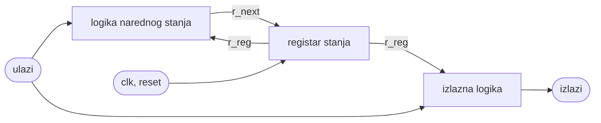

## 9. Projektovanje sekvencijalnih mreža sa regularnom strukturom

**Video:** [Projektovanje sekvencijalnih mreža sa regularnom strukturom](https://www.youtube.com/watch?v=fTYa7lhoetw) (1:24:00) · **Kod:** [`video-tutorials/part-3/video-tutorial-09`](../../video-tutorials/part-3/video-tutorial-09) · **Vezana uputstva:** [Simulacija i testiranje](../simulation-and-testing.md), [Video tutorijali](../video-tutorials.md)

### Sadržaj

| Vrijeme | Tema |
| ---: | ------ |
| [01:11](https://www.youtube.com/watch?v=fTYa7lhoetw&t=71s) | D flip-flop i ivice takta |
| [03:10](https://www.youtube.com/watch?v=fTYa7lhoetw&t=190s) | Leč i flip-flop |
| [04:10](https://www.youtube.com/watch?v=fTYa7lhoetw&t=250s) | Globalno sinhroni, asinhroni i GALS sistemi |
| [08:14](https://www.youtube.com/watch?v=fTYa7lhoetw&t=494s) | Model sekvencijalne mreže: registar, logika narednog stanja, izlazna logika |
| [12:55](https://www.youtube.com/watch?v=fTYa7lhoetw&t=775s) | Regularne i neregularne mreže |
| [15:03](https://www.youtube.com/watch?v=fTYa7lhoetw&t=903s) | Registar sa asinhronim resetom |
| [19:12](https://www.youtube.com/watch?v=fTYa7lhoetw&t=1152s) | `clk'event and clk = '1'` i `rising_edge` |
| [22:44](https://www.youtube.com/watch?v=fTYa7lhoetw&t=1364s) | Univerzalni pomjerački registar |
| [30:46](https://www.youtube.com/watch?v=fTYa7lhoetw&t=1846s) | *Total registers* u izvještaju |
| [33:26](https://www.youtube.com/watch?v=fTYa7lhoetw&t=2006s) | Binarni brojač |
| [38:52](https://www.youtube.com/watch?v=fTYa7lhoetw&t=2332s) | Opis u jednom procesu i neželjeni registarski izlaz |
| [42:51](https://www.youtube.com/watch?v=fTYa7lhoetw&t=2571s) | Programabilni brojač |
| [46:10](https://www.youtube.com/watch?v=fTYa7lhoetw&t=2770s) | Dijeljenje inkrementora |
| [48:20](https://www.youtube.com/watch?v=fTYa7lhoetw&t=2900s) | Greška u jednosegmentnom opisu |
| [50:52](https://www.youtube.com/watch?v=fTYa7lhoetw&t=3052s) | Ispravka pomoću varijable |
| [53:03](https://www.youtube.com/watch?v=fTYa7lhoetw&t=3183s) | Tri česta problema sinhronog dizajna |
| [54:30](https://www.youtube.com/watch?v=fTYa7lhoetw&t=3270s) | Asinhroni reset kao brisanje brojača |
| [57:43](https://www.youtube.com/watch?v=fTYa7lhoetw&t=3463s) | Gejtovani takt |
| [1:00:00](https://www.youtube.com/watch?v=fTYa7lhoetw&t=3600s) | Izvedeni takt i *enable* signal |
| [1:02:49](https://www.youtube.com/watch?v=fTYa7lhoetw&t=3769s) | Tajmer sa izvedenim taktovima |
| [1:09:33](https://www.youtube.com/watch?v=fTYa7lhoetw&t=4173s) | Tajmer sa jednim taktom |
| [1:13:20](https://www.youtube.com/watch?v=fTYa7lhoetw&t=4400s) | Memorija |
| [1:18:05](https://www.youtube.com/watch?v=fTYa7lhoetw&t=4685s) | Blokovska memorija M10K |
| [1:19:35](https://www.youtube.com/watch?v=fTYa7lhoetw&t=4775s) | Atribut `ramstyle` i distribuirana memorija |

### Ključni pojmovi

- **D flip-flop** - memorijski element koji pamti ulaz `d` na aktivnu (rastuću) ivicu takta.
- **Leč** (*latch*) - memorijski element koji je transparentan dok je kontrolni signal aktivan; u FPGA dizajnu se izbjegava.
- **Sinhroni dizajn** - svi flip-flopovi koriste isti takt.
- **GALS** (*Globally Asynchronous, Locally Synchronous*) - dijelovi sistema sa sopstvenim taktovima koji međusobno komuniciraju.
- **Registar stanja / logika narednog stanja / izlazna logika** - tri segmenta modela sekvencijalne mreže (`r_reg`, `r_next`, izlazi).
- **Asinhroni reset** - reset koji djeluje odmah, nezavisno od takta.
- **Enable signal** - impuls trajanja jednog takta koji dozvoljava promjenu stanja; zamjena za izvedeni ili gejtovani takt.
- **Blokovska i distribuirana memorija** - memorija u namjenskim blokovima (M10K) ili u logičkim elementima.

### Objašnjenje

#### Model sekvencijalne mreže

Sekvencijalna mreža pamti stanje u registru (nizu D flip-flopova sa zajedničkim taktom). Kombinaciona **logika narednog stanja** računa `r_next` iz trenutnog stanja i ulaza, a kombinaciona **izlazna logika** računa izlaze. Na rastuću ivicu takta `r_next` se upisuje u registar:



Kod **regularnih** mreža logika narednog stanja je regularna kombinaciona struktura (inkrementor, pomjerač, multiplekser). Neregularne mreže se projektuju kao mašine stanja ([video 10](10-state-machines.md)). U FPGA se koriste flip-flopovi okidani ivicom i sinhroni dizajn; lečevi se izbjegavaju.

#### Registar

[`reg.vhd`](../../video-tutorials/part-3/video-tutorial-09/reg/reg.vhd) je najjednostavnija sekvencijalna mreža, osmobitni registar sa asinhronim resetom:

```vhdl
process(clk, reset)
begin
  if (reset = '1') then
    q <= (others => '0');
  elsif rising_edge(clk) then
    q <= d;
  end if;
end process;
```

Ovaj oblik alat za sintezu prepoznaje kao flip-flopove sa asinhronim resetom: `reset` je u listi osjetljivosti i ispituje se prije ivice, a `rising_edge(clk)` je ekvivalent starijeg zapisa `clk'event and clk = '1'`. Entitet se ne može zvati `register`, jer je to rezervisana riječ VHDL-a. U izvještaju o kompilaciji *Total registers* pokazuje broj flip-flopova: za kombinacionu mrežu mora biti 0, a za sekvencijalnu odgovara broju bita stanja.

#### Univerzalni pomjerački registar

Isti segment registra koristi se u svakoj mreži; mijenja se samo logika narednog stanja. Za pomjerački registar to je selekciona naredba:

```vhdl
-- register segment
process(clk, reset)
begin
  if (reset = '1') then
    r_reg <= (others => '0');
  elsif rising_edge(clk) then
    r_reg <= r_next;
  end if;
end process;
-- next-state logic segment
with ctrl select
  r_next <= r_reg                    when "00", -- pause
            r_reg(2 downto 0) & d(0) when "01", -- shift left
            d(3) & r_reg(3 downto 1) when "10", -- shift right
            d                        when others; -- load
-- output logic segment
q <= r_reg;
```

Ovaj primjer nije u folderu sa kodom; gornji opis je preuzet iz videa.

#### Brojači i opis u jednom procesu

[`binary_counter.vhd`](../../video-tutorials/part-3/video-tutorial-09/binary_counter/binary_counter.vhd) (`two_seg_arch`) računa `r_next <= r_reg + 1`, a izlaz `max_pulse` je kombinaciona funkcija stanja (`'1'` kada je `r_reg = "1111"`). U `one_seg_arch` je cijela logika unutar `elsif rising_edge(clk)`: svaka dodjela u toj grani postaje flip-flop, pa je `max_pulse` registarski izlaz (5 umjesto 4 registra) i kasni jedan takt.

[`prog_counter.vhd`](../../video-tutorials/part-3/video-tutorial-09/prog_counter/prog_counter.vhd) broji po modulu `m` (od 0 do `m - 1`). `two_seg_effi_arch` dijeli inkrementor između brojanja i poređenja:

```vhdl
r_inc <= r_reg + 1;
r_next <= (others => '0') when r_inc = unsigned(m) else
          r_inc;
```

`one_seg_arch` pokušava isto u jednom procesu, ali poredi staru vrijednost `r_reg` (signal se ažurira tek na kraju procesa), pa broji od 0 do `m`, jedno stanje previše. To je namjerno prikazana greška, koju sinteza ne otkriva, ali simulacija da. Ispravka je varijabla, čija vrijednost važi odmah (`variable_arch`):

```vhdl
process(clk, reset)
  variable r_temp : unsigned(3 downto 0);
begin
  if (reset = '1') then
    r_reg <= (others => '0');
  elsif rising_edge(clk) then
    r_temp := r_reg + 1;
    if (r_temp = unsigned(m)) then
      r_reg <= (others => '0');
    else
      r_reg <= r_temp;
    end if;
  end if;
end process;
```

Operator `mod` se ne preporučuje u logici koja se sintetiše; poređenje sa modulom je pouzdanije.

#### Česti problemi sinhronog dizajna

- **Asinhroni reset za brisanje**: ako se izlaz komparatora vodi na asinhroni reset (npr. dekadni brojač koji se briše kada dostigne 10), brojač kratko prolazi kroz nedozvoljeno stanje. Brisanje treba opisati u logici narednog stanja.
- **Gejtovani takt** (`clk and en`): logika na putu takta kvari raspodjelu takta i vremensku analizu. Umjesto toga, `en` se koristi u logici narednog stanja (`r_next <= r_reg` kada `en = '0'`).
- **Izvedeni takt**: izlaz djelitelja frekvencije kao takt drugog dijela dizajna otežava vremensku analizu i interakciju dijelova. Djelitelj treba da generiše *enable* impuls, a svi registri koriste isti takt.

#### Tajmer: izvedeni takt i *enable*

[`timer.vhd`](../../video-tutorials/part-3/video-tutorial-09/timer/timer.vhd) dijeli takt od 1 MHz brojačem do 999999 i broji sekunde i minute. `multi_clock_arch` koristi izlaze brojača (`sclk`, `mclk`) kao taktove sljedećih brojača, što je primjer izvedenog takta koji treba izbjegavati. `single_clock_arch` sve registre pokreće istim taktom, a brojač sekundi napreduje samo kada je aktivan *enable*:

```vhdl
s_en <= '1' when r_reg = 500000 else
        '0';
s_next <= (others => '0') when (s_reg = 59 and s_en = '1') else
          s_reg + 1 when s_en = '1' else
          s_reg;
m_en <= '1' when (s_reg = 30 and s_en = '1') else
        '0';
```

> **Napomena o grešci u videu:** U videu (i ranije u kodu) *enable* je bio `s_en <= '1' when r_reg < 500000`, što drži `s_en` aktivnim 500000 taktova zaredom, pa bi brojač sekundi napredovao na svaki od njih. *Enable* mora trajati jedan takt u sekundi (`r_reg = 500000`). Kod je ispravljen i označen komentarom `NOTE`. Simulacija sa skraćenim djeliteljem potvrđuje da ispravljena verzija broji kao `multi_clock_arch` (kasni jedan takt), a originalna višestruko prebrzo. Kao i u `multi_clock_arch`, minuti se uvećavaju kada sekunde pređu 30, ne kada se vrate na 0.

#### Memorija

[`memory.vhd`](../../video-tutorials/part-3/video-tutorial-09/memory/memory.vhd) (šablon iz **Edit &rarr; Insert Template &rarr; VHDL &rarr; Full Designs &rarr; RAMs and ROMs**) opisuje RAM kao niz riječi:

```vhdl
subtype word_t is std_logic_vector((DATA_WIDTH-1) downto 0);
type memory_t is array(2**ADDR_WIDTH-1 downto 0) of word_t;
signal ram : memory_t;
```

Upis je sinhron, a adresa za čitanje se pamti u registru (`addr_reg`). Sinteza prepoznaje memoriju i smješta je u blokovsku memoriju: 64 &times; 8 = 512 bita zauzima cijeli M10K blok (10 kilobita), a samo 1 ALM. Za male memorije atribut `ramstyle` sa vrijednošću `"MLAB"` traži implementaciju u logičkim elementima (u videu 276 ALM-ova, bez blokovske memorije). Velike memorije treba implementirati u M10K blokovima.

```vhdl
attribute ramstyle : string;
attribute ramstyle of ram : signal is "MLAB";
```

> **Napomena:** U videu se atribut uzima iz paketa `altera.altera_syn_attributes`. Biblioteka `altera` postoji samo u *Intel* alatima, pa simulatori kao GHDL ne mogu da prevedu takav fajl. U kodu je atribut zato deklarisan lokalno (`attribute ramstyle : string;`), što *Quartus* prepoznaje po imenu atributa, pa je rezultat sinteze isti (komentar `NOTE` u kodu).

> **Napomena o greškama u videu:** Nekoliko manjih omaški u govoru: najveća vrijednost četvorobitnog brojača je 15, ne 16 ([33:37](https://www.youtube.com/watch?v=fTYa7lhoetw&t=2017s)); dekadni brojač se nakon 9 vraća na 0, ne na 10 ([42:51](https://www.youtube.com/watch?v=fTYa7lhoetw&t=2571s)); funkcija `"01"` pomjeračkog registra pomjera sadržaj ulijevo, ne udesno ([29:11](https://www.youtube.com/watch?v=fTYa7lhoetw&t=1751s)); blokovi memorije u Cyclone V čipu su M10K, ne M20K ([1:20:15](https://www.youtube.com/watch?v=fTYa7lhoetw&t=4815s)).

### Primjer

Folder [`video-tutorials/part-3/video-tutorial-09`](../../video-tutorials/part-3/video-tutorial-09) sadrži `reg`, `binary_counter`, `prog_counter`, `timer` i `memory`; fajlovi sa više arhitektura imaju konfiguraciju za izbor. Vježbe:

1. Napišite testbench za `prog_counter` i uporedite `two_seg_clear_arch` i `one_seg_arch` za `m = "1010"`: prva broji 0-9, druga 0-10.
2. Prevedite `binary_counter` sa obje arhitekture i uporedite *Total registers* (4 i 5).
3. Prevedite `memory` sa i bez atributa `ramstyle` i uporedite *Total block memory bits* i *Logic utilization*.

`memory.vhd` se prevodi i u *Quartus*-u i u simulatoru (atribut `ramstyle` je deklarisan lokalno).

### Česte greške

- **Logika narednog stanja unutar `elsif rising_edge(clk)`**: neželjeni registri i izlazi koji kasne jedan takt.
- **Poređenje signala koji je dodijeljen u istom procesu**: čita se stara vrijednost; koristite varijablu ili odvojenu logiku narednog stanja.
- **Asinhroni reset iz logike**: kratka nedozvoljena stanja; brišite sinhrono.
- **Logika na putu takta** (gejtovani ili izvedeni takt): koristite *enable* i jedan takt.
- ***Enable* koji traje duže od jednog takta**: brojač napreduje na svaki takt dok je aktivan.
- **Naziv entiteta `register`**: rezervisana riječ.
- **Mala memorija u blokovskom RAM-u**: zauzima cijeli M10K blok; razmotrite `ramstyle`.

### Provjera znanja

1. Koja su tri segmenta modela sekvencijalne mreže i koji je od njih uvijek isti?
2. Zašto `one_seg_arch` binarnog brojača ima pet registara?
3. Zašto jednosegmentni programabilni brojač broji jedno stanje previše i kako varijabla to ispravlja?
4. Zašto se izvedeni takt zamjenjuje *enable* signalom i koliko dugo *enable* treba da traje?
5. Kada je bolje implementirati memoriju u logičkim elementima nego u M10K bloku?

<details>
<summary>Odgovori</summary>

1. Registar stanja, logika narednog stanja i izlazna logika; registar stanja (proces sa resetom i `rising_edge`) uvijek ima isti oblik.
2. `max_pulse` se dodjeljuje unutar `elsif rising_edge(clk)`, pa sinteza za njega pravi dodatni flip-flop (registarski izlaz koji kasni jedan takt).
3. Poređenje koristi staru vrijednost `r_reg`, jer se signal ažurira tek na kraju procesa; varijabla `r_temp := r_reg + 1` ima novu vrijednost odmah, pa se poredi ispravna vrijednost.
4. Logika na putu takta otežava vremensku analizu i raspodjelu takta; sa *enable* signalom svi registri rade sa istim taktom. *Enable* treba da traje tačno jedan takt po događaju.
5. Za male memorije (do nekoliko stotina bita), koje bi zauzele cijeli blok od 10 kilobita.

</details>

### Dodatni materijali

- Prethodni video: [8. Optimizacija kombinacionih mreža](https://www.youtube.com/watch?v=hhH37OIjS3U)
- Sljedeći video: [10. Projektovanje sekvencijalnih mreža metodologijom mašina stanja](https://www.youtube.com/watch?v=UbAJiexhklk)
- Kratke teme: [Fajl za inicijalizaciju memorije](https://www.youtube.com/watch?v=ScZWPQ2UmE4), [Adding PLL to Quartus design](https://www.youtube.com/watch?v=V6xj6NznBdY), [Clock skew and timing analysis](https://www.youtube.com/watch?v=VQlkn-XPkd4)
- [Video tutorijali](../video-tutorials.md) - pregled svih videa
