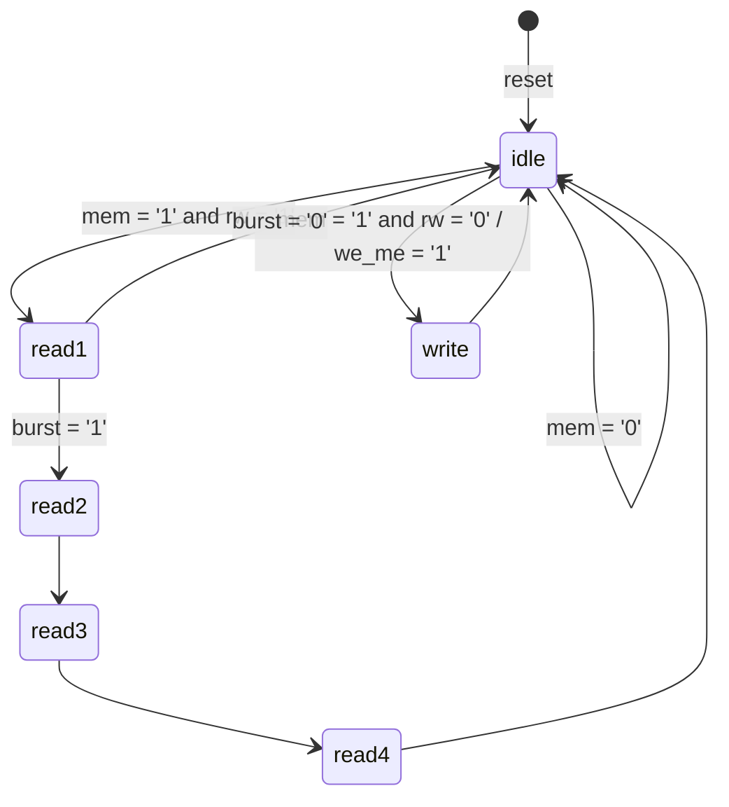

## 10. Projektovanje sekvencijalnih mreža metodologijom mašina stanja

**Video:** [Projektovanje sekvencijalnih mreža metodologijom mašina stanja](https://www.youtube.com/watch?v=UbAJiexhklk) (53:59) · **Kod:** [`video-tutorials/part-3/video-tutorial-10/mem_ctrl`](../../video-tutorials/part-3/video-tutorial-10/mem_ctrl) · **Vezana uputstva:** [Simulacija i testiranje](../simulation-and-testing.md), [Video tutorijali](../video-tutorials.md)

### Sadržaj

| Vrijeme | Tema |
| ---: | ------ |
| [00:00](https://www.youtube.com/watch?v=UbAJiexhklk&t=0s) | Mreže sa nepravilnom strukturom (*random logic*) i mašine sa konačnim brojem stanja |
| [01:05](https://www.youtube.com/watch?v=UbAJiexhklk&t=65s) | Blok dijagram: registar stanja, logika narednog stanja, Moore i Mealy izlazi |
| [03:29](https://www.youtube.com/watch?v=UbAJiexhklk&t=209s) | Dijagram stanja kontrolera memorije |
| [07:47](https://www.youtube.com/watch?v=UbAJiexhklk&t=467s) | *Burst* čitanje, bezuslovne tranzicije, sinhroni prelazi |
| [10:00](https://www.youtube.com/watch?v=UbAJiexhklk&t=600s) | VHDL: enumerisani tip stanja i signali `state_reg` i `state_next` |
| [12:51](https://www.youtube.com/watch?v=UbAJiexhklk&t=771s) | Registar stanja |
| [13:48](https://www.youtube.com/watch?v=UbAJiexhklk&t=828s) | Logika narednog stanja (`case`-`when`) |
| [16:39](https://www.youtube.com/watch?v=UbAJiexhklk&t=999s) | Moore izlazna logika |
| [18:54](https://www.youtube.com/watch?v=UbAJiexhklk&t=1134s) | Mealy izlazna logika |
| [20:39](https://www.youtube.com/watch?v=UbAJiexhklk&t=1239s) | Sinteza: *RTL Viewer* i *State Machine Viewer* |
| [24:02](https://www.youtube.com/watch?v=UbAJiexhklk&t=1442s) | Kompaktniji opis Mealy izlaza naredbom `when`-`else` |
| [26:03](https://www.youtube.com/watch?v=UbAJiexhklk&t=1563s) | Opis sa dva segmenta |
| [30:47](https://www.youtube.com/watch?v=UbAJiexhklk&t=1847s) | Opis sa jednim segmentom i registri na izlazima |
| [33:25](https://www.youtube.com/watch?v=UbAJiexhklk&t=2005s) | Kodovanje stanja: binarno, Gray, *one-hot*, *almost one-hot* |
| [36:48](https://www.youtube.com/watch?v=UbAJiexhklk&t=2208s) | Atribut `enum_encoding` |
| [40:00](https://www.youtube.com/watch?v=UbAJiexhklk&t=2400s) | Stanja kao konstante tipa `std_logic_vector` |
| [43:33](https://www.youtube.com/watch?v=UbAJiexhklk&t=2613s) | Izlazi direktno iz bita registra stanja |
| [47:15](https://www.youtube.com/watch?v=UbAJiexhklk&t=2835s) | Baferovani izlazi i *look-ahead* bafer |
| [52:40](https://www.youtube.com/watch?v=UbAJiexhklk&t=3160s) | Zaključak |

### Ključni pojmovi

- **Mašina sa konačnim brojem stanja** (*finite state machine*, FSM) - sekvencijalna mreža opisana skupom stanja, prelazima između njih i izlazima; koristi se kada logika narednog stanja i izlaza nema pravilnu strukturu (*random logic*).
- **Registar stanja** (`state_reg`) - memorijski elementi koji čuvaju trenutno stanje; mijenjaju se samo na aktivnu ivicu takta (ili asinhronim resetom).
- **Logika narednog stanja** (*next-state logic*) - kombinaciona mreža koja na osnovu trenutnog stanja i ulaza određuje naredno stanje (`state_next`).
- **Moore izlaz** - izlaz koji zavisi samo od trenutnog stanja; u dijagramu stanja upisuje se unutar stanja.
- **Mealy izlaz** - izlaz koji zavisi od trenutnog stanja i od ulaza; u dijagramu stanja upisuje se na tranziciji (iza znaka `/`).
- **Bezuslovna tranzicija** - prelaz koji se dešava na sljedeću ivicu takta bez ispitivanja ulaza.
- **Kodovanje stanja** - dodjela binarnih kombinacija stanjima (binarno, Gray, *one-hot*, *almost one-hot*, proizvoljno).
- **Baferovani izlaz** - izlaz propušten kroz registar, bez gličeva, ali zakašnjen za jedan takt; *look-ahead* bafer uklanja to kašnjenje.
- **Glič** (*glitch*) - kratkotrajna neželjena promjena kombinacionog izlaza tokom promjene ulaza ili stanja.

### Objašnjenje

#### Struktura mašine stanja

Mašina stanja se sastoji od tri dijela: registra stanja, logike narednog stanja i izlazne logike. Registar stanja čuva trenutno stanje (`state_reg`), a logika narednog stanja na osnovu njega i ulaza računa naredno stanje (`state_next`), koje se upisuje u registar na aktivnu ivicu takta. Izlazna logika Moore tipa zavisi samo od `state_reg`, a Mealy tipa i od ulaza. Prelazi su uvijek sinhroni: postavljanje ulaza nije dovoljno, promjena stanja se dešava tek na aktivnu ivicu takta.

#### Primjer: kontroler memorije

Kontroler ima ulaze `mem` (zahtjev za pristup memoriji), `rw` (`'1'` čitanje, `'0'` upis) i `burst` (čitanje četiri uzastopne riječi), Moore izlaze `oe` (*output enable*) i `we` (*write enable*) i Mealy izlaz `we_me`, koji ima istu funkciju kao `we`, ali se aktivira već na tranziciji u stanje `write`.



| Stanje | `oe` | `we` | Napomena |
| ------ | :---: | :---: | ------ |
| `idle` | 0 | 0 | čekanje zahtjeva; `we_me = '1'` pri prelazu u `write` |
| `write` | 0 | 1 | upis, zatim bezuslovno u `idle` |
| `read1` | 1 | 0 | prvo čitanje; nastavak samo ako je `burst = '1'` |
| `read2`, `read3`, `read4` | 1 | 0 | *burst* čitanje, bezuslovni prelazi |

Vrijednosti koje nisu upisane u dijagram podrazumijevano su `'0'`.

#### Opis u VHDL-u sa više segmenata (preporučeno)

Stanja se navode kao enumerisani tip, a trenutno i naredno stanje su signali tog tipa:

```vhdl
type mc_sm_type is
  (idle, read1, read2, read3, read4, write);
signal state_reg, state_next : mc_sm_type;
```

Svaki blok iz blok dijagrama opisuje se posebnim procesom. Registar stanja sa asinhronim resetom:

```vhdl
process(clk, reset)
begin
  if (reset = '1') then
    state_reg <= idle;
  elsif rising_edge(clk) then
    state_reg <= state_next;
  end if;
end process;
```

Logika narednog stanja je `case` naredba po trenutnom stanju koja direktno prepisuje dijagram stanja (u ovom procesu nema izlaza):

```vhdl
process(state_reg, mem, rw, burst)
begin
  case state_reg is
    when idle =>
      if mem = '1' then
        if rw = '1' then
          state_next <= read1;
        else
          state_next <= write;
        end if;
      else
        state_next <= idle;
      end if;
    when write =>
      state_next <= idle;
    when read1 =>
      if burst = '1' then
        state_next <= read2;
      else
        state_next <= idle;
      end if;
    when read2 =>
      state_next <= read3;
    when read3 =>
      state_next <= read4;
    when read4 =>
      state_next <= idle;
  end case;
end process;
```

Moore izlazna logika zavisi samo od `state_reg`, pa je samo on u listi osjetljivosti. Podrazumijevane vrijednosti na početku procesa obezbjeđuju da je izlaz dodijeljen u svim granama (inače sinteza pravi leč):

```vhdl
process(state_reg)
begin
  we <= '0';  -- default value
  oe <= '0';  -- default value
  case state_reg is
    when idle =>
    when write =>
      we <= '1';
    when read1 | read2 | read3 | read4 =>
      oe <= '1';
  end case;
end process;
```

Mealy izlazna logika zavisi i od ulaza, pa su `mem` i `rw` u listi osjetljivosti:

```vhdl
process(state_reg, mem, rw)
begin
  we_me <= '0';  -- default value
  case state_reg is
    when idle =>
      if (mem = '1') and (rw = '0') then
        we_me <= '1';
      end if;
    when others =>
  end case;
end process;
```

Isti Mealy izlaz može se napisati i kraće, kao `we_me <= '1' when (state_reg = idle) and (mem = '1') and (rw = '0') else '0';`. Rezultat sinteze je isti, ali opis procesom sa `case` naredbom direktno prati dijagram stanja i zato se preporučuje.

#### Sinteza i provjera u alatu Quartus

Nakon sinteze, *RTL Viewer* prikazuje mašinu stanja kao jedan blok, a dvoklikom na njega otvara se *State Machine Viewer* sa dijagramom stanja, tabelom tranzicija i tabelom kodovanja. Tako se može vizuelno potvrditi da implementacija odgovara specifikaciji. Za ovaj primjer sinteza koristi šest registara, jer alat podrazumijevano bira *one-hot* kodovanje (jedan registar po stanju).

#### Manji broj segmenata

- **Dva segmenta** (`two_seg_arch`): registar stanja u jednom procesu, a logika narednog stanja i svi izlazi u drugom. Kod je kompaktniji, rezultat sinteze je praktično isti, ali opis slabije prati blok dijagram.
- **Jedan segment** (`one_seg_wrong_arch`): sve je u jednom taktovanom procesu i nema signala `state_next`. Svaki signal kome se dodjeljuje vrijednost u taktovanom procesu postaje registar, pa sinteza daje devet registara umjesto šest: izlazi su registrovani i kasne za jedan takt u odnosu na specifikaciju. Zato se ovaj opis ne koristi.

#### Kodovanje stanja

Šest stanja se može kodovati sa tri bita (binarno ili Gray), sa šest bita (*one-hot*) ili sa pet bita (*almost one-hot*, gdje je početno stanje sve nule). *One-hot* koristi više registara, ali obično daje jednostavniju logiku narednog stanja, pa je to čest izbor alata za sintezu.

Kodovanje se može zadati atributom `enum_encoding` (vrijednosti `"sequential"`, `"gray"`, `"johnson"`, `"one-hot"`, `"default"`, `"auto"` ili lista kodova). Kodovi u listi se dodjeljuju stanjima **redom kojim su navedena u deklaraciji tipa**:

```vhdl
attribute enum_encoding : string;
attribute enum_encoding of mc_sm_type : type is "0000 1000 1001 1010 1011 0100";
-- idle = 0000, read1 = 1000, read2 = 1001, read3 = 1010, read4 = 1011, write = 0100
```

> **Napomena o grešci u videu:** U videu (od [36:48](https://www.youtube.com/watch?v=UbAJiexhklk&t=2208s)) i u originalnom kodu primjera lista kodova u atributu `enum_encoding` navedena je redoslijedom idle, write, read1-read4, a ne redoslijedom stanja iz deklaracije tipa. Stanje `read1` bi tako dobilo kod `0100` (bit koji određuje `we`), a `write` kod `1011`. U kodu repozitorijuma ([`mem_ctrl.vhd`](../../video-tutorials/part-3/video-tutorial-10/mem_ctrl/mem_ctrl.vhd)) i na ovoj stranici lista je ispravljena; ispravan je i dio koda sa konstantama, koji se u videu koristi za izvođenje izlaza iz bita stanja.

Ako alat ne podržava ovaj atribut, stanja se mogu definisati kao konstante tipa `std_logic_vector`, a `state_reg` i `state_next` kao signali tog tipa. Tada su u svim `case` naredbama obavezne grane `when others`, jer `std_logic_vector` ima i druge vrijednosti osim navedenih stanja.

Uz ovakvo kodovanje, bit 3 je `'1'` upravo u stanjima čitanja, a bit 2 upravo u stanju upisa. Tada se cijela Moore izlazna logika zamjenjuje sa dvije naredbe (moguće samo kada je `state_reg` tipa `std_logic_vector`):

```vhdl
oe <= state_reg(3);
we <= state_reg(2);
```

Sa proizvoljnim kodovanjem sinteza u videu koristi četiri registra umjesto šest.

#### Baferovani izlazi i *look-ahead* bafer

Kombinaciona izlazna logika može da generiše gličeve, što u nekim primjenama nije dozvoljeno. Rješenje je da se izlazi propuste kroz registar (*output buffer*), ali tada kasne za jedan takt (`plain_buffer_arch`). Kod Moore mašine to kašnjenje se uklanja tako što se izlazna logika računa iz narednog stanja (`state_next`) umjesto iz trenutnog: vrijednost upisana u izlazni registar na ivicu takta tada odgovara stanju u koje se upravo prelazi (`lookahead_buffer_arch`). Izlazi su bez gličeva i bez kašnjenja, uz dva dodatna registra (ukupno osam).

```vhdl
process(state_next)
begin
  we_next <= '0';  -- default value
  oe_next <= '0';  -- default value
  case state_next is
    when idle =>
    when write =>
      we_next <= '1';
    when read1 | read2 | read3 | read4 =>
      oe_next <= '1';
  end case;
end process;
```

### Primjer

Fajl [`mem_ctrl.vhd`](../../video-tutorials/part-3/video-tutorial-10/mem_ctrl/mem_ctrl.vhd) sadrži entitet `mem_ctrl` i pet arhitektura iz videa:

| Arhitektura | Opis | Registara u sintezi |
| ------ | ------ | :---: |
| `multi_seg_arch` | registar stanja, logika narednog stanja, Moore i Mealy izlazi u zasebnim procesima (preporučeno) | 6 (*one-hot*) |
| `two_seg_arch` | registar stanja + jedan proces za naredno stanje i izlaze | 6 |
| `one_seg_wrong_arch` | sve u jednom taktovanom procesu (izlazi kasne za jedan takt) | 9 |
| `plain_buffer_arch` | Moore izlazi kroz izlazni registar (kasne za jedan takt) | 8 |
| `lookahead_buffer_arch` | izlazni registar puni se iz `state_next` (bez kašnjenja) | 8 |

Arhitektura koja se koristi bira se konfiguracijom na kraju fajla:

```vhdl
configuration mem_ctrl_cfg of mem_ctrl is
  for multi_seg_arch
  end for;
end mem_ctrl_cfg;
```

Provjera sintakse i elaboracija (iz foldera sa fajlom):

```
ghdl -a --std=08 mem_ctrl.vhd
ghdl -e --std=08 mem_ctrl_cfg
```

Za poređenje rezultata sinteze napravite *Quartus* projekat sa fajlom `mem_ctrl.vhd`, promijenite arhitekturu u konfiguraciji, pokrenite **Analysis & Synthesis** i uporedite broj registara u izvještaju (*Compilation Report*) i prikaz u **Tools &rarr; Netlist Viewers &rarr; State Machine Viewer**. Folder ne sadrži *testbench*: za vježbu napišite samoprovjeravajući *testbench* koji prolazi kroz sve tranzicije ([Simulacija i testiranje](../simulation-and-testing.md)) i uporedite talasne oblike izlaza `oe` i `we` za arhitekture `multi_seg_arch`, `one_seg_wrong_arch` i `lookahead_buffer_arch`.

Kod u folderu `video-tutorials` odgovara kodu iz videa (uz ispravku opisanu u napomeni iznad) i ne prati pravila stila kursa; u rješenjima zadataka ga prilagodite ([Pravila za formatiranje VHDL opisa](../vhdl-code-style.md)).

### Česte greške

- **Izlaz nije dodijeljen u svim granama** kombinacionog procesa: sinteza pravi leč. Na početku procesa dodijelite podrazumijevane vrijednosti svim izlazima (i `state_next`, ako sve grane ne dodjeljuju naredno stanje).
- **Nepotpuna lista osjetljivosti**: Mealy proces mora sadržati i ulaze od kojih zavisi, a proces logike narednog stanja sve ulaze koje ispituje. Simulacija se inače razlikuje od sintetizovanog kola.
- **Sve u jednom taktovanom procesu**: izlazi postaju registri i kasne za jedan takt.
- **Stanja kao `std_logic_vector` bez `when others`**: `case` naredba nije potpuna i prevođenje ne uspijeva.
- **Redoslijed kodova u `enum_encoding`** ne prati redoslijed stanja u deklaraciji tipa, pa stanja dobiju pogrešne kodove.
- **Očekivanje da se stanje promijeni čim se promijeni ulaz**: prelazi se dešavaju tek na aktivnu ivicu takta.
- **Mealy izlaz iskorišćen tamo gdje gličevi nisu dozvoljeni**: koristite Moore izlaz ili baferovani izlaz (po mogućnosti *look-ahead*).

### Provjera znanja

1. Po čemu se u dijagramu stanja razlikuju Moore i Mealy izlazi i od čega zavisi svaki od njih?
2. Zašto u listi osjetljivosti procesa Moore izlazne logike treba da bude samo `state_reg`, a u Mealy procesu i ulazi?
3. Zašto opis mašine stanja sa jednim taktovanim procesom daje više registara i kakva je posljedica za izlaze?
4. Koliko registara zahtijeva *one-hot*, a koliko binarno kodovanje šest stanja, i zašto alati za sintezu često biraju *one-hot*?
5. Kako *look-ahead* bafer uklanja kašnjenje baferovanog izlaza i zašto je primjenljiv samo na Moore izlaze?

<details>
<summary>Odgovori</summary>

1. Moore izlaz se upisuje unutar stanja i zavisi samo od trenutnog stanja; Mealy izlaz se upisuje na tranziciji i zavisi od trenutnog stanja i ulaza.
2. Proces treba da se izvrši kad god se promijeni neki signal od kojeg izlaz zavisi; Moore izlaz zavisi samo od stanja, Mealy i od ulaza. Nepotpuna lista daje razliku između simulacije i sinteze.
3. Svaki signal kome se dodjeljuje vrijednost u taktovanom procesu postaje registar, pa i izlazi; zato se ažuriraju jedan takt kasnije nego što specifikacija zahtijeva.
4. *One-hot* šest, binarno tri registra; *one-hot* obično daje jednostavniju logiku narednog stanja, a FPGA ima mnogo registara.
5. Izlazna logika računa izlaze iz `state_next`, pa izlazni registar na ivicu takta dobija vrijednost koja odgovara novom stanju. Mealy izlaz zavisi i od ulaza u trenutnom taktu, pa se ne može unaprijed izračunati iz narednog stanja.

</details>

### Dodatni materijali

- Prethodni video: [9. Projektovanje sekvencijalnih mreža sa regularnom strukturom](https://www.youtube.com/watch?v=fTYa7lhoetw)
- Sljedeći video: [11. Projektovanje sekvencijalnih mreža Register-Transfer metodologijom](https://www.youtube.com/watch?v=39Tch03-rAU)
- Kratke teme: [Algorithmic State Machines (ASM)](https://www.youtube.com/watch?v=KHZtNmtEX_E), [State Machine Editor](https://www.youtube.com/watch?v=mJtIjkAMuYc)
- [Video tutorijali](../video-tutorials.md) - pregled svih videa
