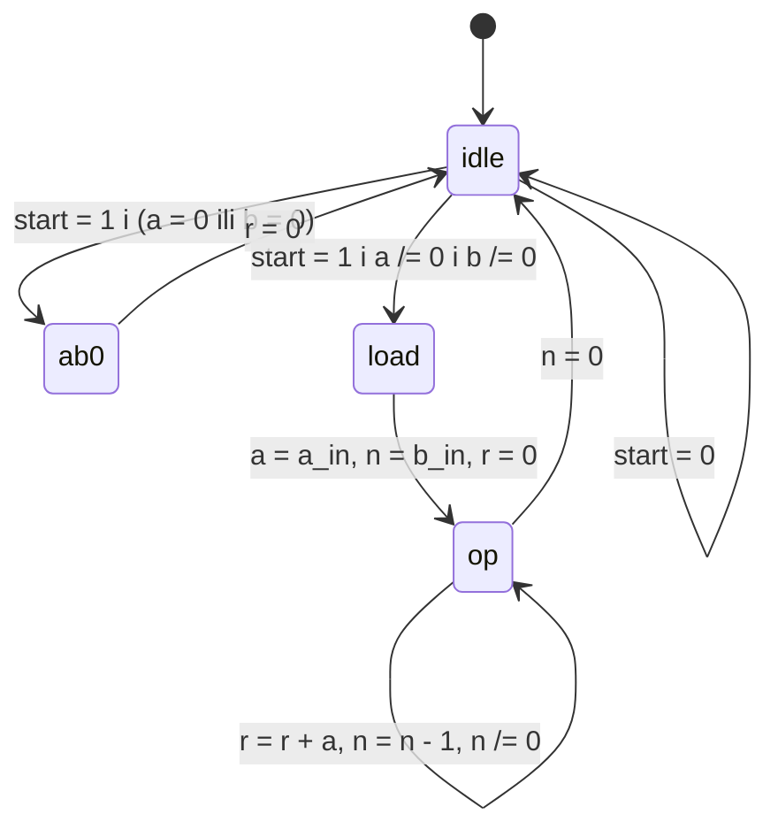

## 11. Projektovanje sekvencijalnih mreža Register-Transfer metodologijom

**Video:** [Projektovanje sekvencijalnih mreža Register-Transfer metodologijom](https://www.youtube.com/watch?v=39Tch03-rAU) (34:39) · **Kod:** [`video-tutorials/part-3/video-tutorial-11`](../../video-tutorials/part-3/video-tutorial-11) · **Vezana uputstva:** [Simulacija i testiranje](../simulation-and-testing.md), [Video tutorijali](../video-tutorials.md)

### Sadržaj

| Vrijeme | Tema |
| ---: | ------ |
| [00:10](https://www.youtube.com/watch?v=39Tch03-rAU&t=10s) | Algoritmi u hardveru |
| [01:02](https://www.youtube.com/watch?v=39Tch03-rAU&t=62s) | *Control path* i *data path* |
| [03:24](https://www.youtube.com/watch?v=39Tch03-rAU&t=204s) | Register-transfer (RT) metodologija |
| [03:54](https://www.youtube.com/watch?v=39Tch03-rAU&t=234s) | Množenje uzastopnim sabiranjem |
| [05:51](https://www.youtube.com/watch?v=39Tch03-rAU&t=351s) | Algoritam bez `while` petlje |
| [06:36](https://www.youtube.com/watch?v=39Tch03-rAU&t=396s) | Dijagram stanja množača |
| [10:00](https://www.youtube.com/watch?v=39Tch03-rAU&t=600s) | Entitet i signali |
| [11:58](https://www.youtube.com/watch?v=39Tch03-rAU&t=718s) | *Control path*: registar stanja i logika prelaza |
| [13:52](https://www.youtube.com/watch?v=39Tch03-rAU&t=832s) | *Data path*: registri i multiplekseri za rutiranje |
| [16:57](https://www.youtube.com/watch?v=39Tch03-rAU&t=1017s) | Funkcionalne jedinice i statusni signali |
| [18:32](https://www.youtube.com/watch?v=39Tch03-rAU&t=1112s) | Rezultat sinteze |
| [21:13](https://www.youtube.com/watch?v=39Tch03-rAU&t=1273s) | Opis sa četiri segmenta |
| [23:26](https://www.youtube.com/watch?v=39Tch03-rAU&t=1406s) | Opis sa dva segmenta |
| [25:00](https://www.youtube.com/watch?v=39Tch03-rAU&t=1500s) | Opis u jednom procesu |
| [25:57](https://www.youtube.com/watch?v=39Tch03-rAU&t=1557s) | Dijeljenje sabirača: stanja `op1` i `op2` |
| [32:50](https://www.youtube.com/watch?v=39Tch03-rAU&t=1970s) | Rezime |

### Ključni pojmovi

- **RT metodologija** (*register-transfer*) - algoritam se realizuje kao niz prenosa podataka između registara kroz funkcionalne jedinice, korak po korak, u taktu.
- **Control path** - mašina stanja koja određuje koja se operacija izvršava u kom taktu.
- **Data path** - registri (promjenljive algoritma), funkcionalne jedinice (sabirači, oduzimači, komparatori) i multiplekseri za rutiranje.
- **FSMD** (*FSM with data path*) - kombinacija mašine stanja i data path-a.
- **Statusni signal** - signal iz data path-a koji utiče na prelaze mašine stanja (npr. `count_0`).
- **Komanda / eksterni status** - ulaz koji pokreće algoritam (`start`) i izlaz koji javlja da je algoritam završen (`ready`).

### Objašnjenje

#### Control path i data path

Algoritam koji zahtijeva više koraka realizuje se kao specijalizovani procesor. *Data path* sadrži registre za promjenljive algoritma i funkcionalne jedinice, a multiplekseri povezuju registre sa ulazima jedinica i izlaze jedinica sa registrima. *Control path* je mašina stanja: na osnovu komande (`start`) i statusnih signala iz data path-a bira stanje, a stanje određuje šta multiplekseri rutiraju u sljedećem taktu. RT metodologija (*register-transfer*) se ne treba miješati sa RTL nivoom apstrakcije koji prikazuje *RTL Viewer*.

#### Množač sa uzastopnim sabiranjem

Proizvod `a * b` dobija se sabiranjem `a` sa samim sobom `b` puta. Registri su `a` (operand), `n` (brojač iteracija, početno `b`) i `r` (rezultat, dvostruke širine). Petlja `while` se zamjenjuje stanjima:



Izlaz `ready` je `'1'` samo u stanju `idle`. Množenje traje `b + 2` takta (`load`, `b` puta `op`, povratak u `idle`).

#### Opis sa više segmenata

Preporučeni opis ([`seq_mult.vhd`](../../video-tutorials/part-3/video-tutorial-11/seq_mult/seq_mult.vhd), `multi_seg_arch`) ima zaseban proces ili naredbu za svaki blok: registar stanja, logiku prelaza, izlaznu logiku, registre podataka, multipleksere za rutiranje, funkcionalne jedinice i statusne signale. Multiplekseri za rutiranje biraju naredne vrijednosti registara prema stanju:

```vhdl
  process(state_reg, a_reg, n_reg, r_reg,
        a_in, b_in, adder_out, sub_out)
  begin
    case state_reg is
      when idle =>
        a_next <= a_reg;
        n_next <= n_reg;
        r_next <= r_reg;
      when ab0 =>
        a_next <= unsigned(a_in);
        n_next <= unsigned(b_in);
        r_next <= (others => '0');
      when load =>
        a_next <= unsigned(a_in);
        n_next <= unsigned(b_in);
        r_next <= (others => '0');
      when op =>
        a_next <= a_reg;
        n_next <= sub_out;
        r_next <= adder_out;
    end case;
  end process;
  -- data path: functional units
  adder_out <= ("00000000" & a_reg) + r_reg;
  sub_out <= n_reg - 1;
  -- data path: status
  a_is_0 <= '1' when a_in = "00000000" else '0';
  b_is_0 <= '1' when b_in = "00000000" else '0';
  count_0 <= '1' when n_next = "00000000" else '0';
```

`count_0` se računa iz `n_next`, pa mašina napušta stanje `op` u istom taktu u kojem `n` postaje nula. Sinteza daje 36 registara: 8 + 8 + 16 bita podataka i 4 bita za stanje (*one-hot* kodiranje).

#### Kompaktniji opisi

Ista funkcionalnost može se opisati sa manje segmenata:

| Arhitektura | Struktura |
| ------ | ------ |
| `multi_seg_arch` | svaki blok posebno (preporučeno) |
| `four_seg_arch` | registar stanja, logika control path-a, registri podataka, logika data path-a |
| `two_seg_arch` | svi registri u jednom procesu, sva kombinaciona logika u drugom |
| `one_seg_arch` | sve u jednom procesu, sa varijablom `n_next` |

Sve četiri daju isti rezultat i isti broj taktova. Opis u jednom procesu je najkraći, ali lako uvodi neželjene flip-flopove (vidi [video 9](09-regular-sequential-circuits.md)); opis sa više segmenata direktno odgovara blok-šemi sistema, pa je preporučen.

#### Dijeljenje sabirača

`sharing_arch` koristi jedan 16-bitni sabirač i za sabiranje i za dekrementovanje, po cijenu jednog dodatnog stanja: u `op1` računa `r + a`, a u `op2` `n + "1111111111111111"`, što je u nižih osam bita `n - 1`:

```vhdl
  process(state_reg, r_reg, a_reg, n_reg)
  begin
    if (state_reg = op1) then
      adder_src1 <= r_reg;
      adder_src2 <= "00000000" & a_reg;
    else  -- for op2 state
      adder_src1 <= "00000000" & n_reg;
      adder_src2 <= (others => '1');
    end if;
  end process;
  adder_out <= adder_src1 + adder_src2;
```

Množenje sada traje `2b + 2` takta. Ušteda jednog sabirača je ovdje mala, ali ista tehnika ima smisla kada je funkcionalna jedinica skupa (npr. množač).

> **Napomena o greškama u videu:** Na [06:36](https://www.youtube.com/watch?v=39Tch03-rAU&t=396s) se kaže da se u stanju `op` rezultat `r` sabira „sam sa sobom”; sabira se sa `a` (`r = r + a`), kao što je ispravno rečeno na [16:57](https://www.youtube.com/watch?v=39Tch03-rAU&t=1017s). Na [27:44](https://www.youtube.com/watch?v=39Tch03-rAU&t=1664s) se kaže da `op1` dekrementuje `n`, a `op2` sabira; u kodu (i na [30:27](https://www.youtube.com/watch?v=39Tch03-rAU&t=1827s)) je obrnuto: `op1` sabira, a `op2` dekrementuje.

### Primjer

[`seq_mult.vhd`](../../video-tutorials/part-3/video-tutorial-11/seq_mult/seq_mult.vhd) sadrži svih pet arhitektura i konfiguraciju `seq_mult_cfg`. Napišite testbench koji:

1. postavi `a_in`, `b_in` i jedan takt `start = '1'`,
2. čeka da `ready` ponovo postane `'1'`,
3. provjeri `r` naredbom `assert` (`to_integer(unsigned(r)) = a * b`, `severity error`) i izbroji taktove.

Pokrenite testbench za `multi_seg_arch` i `sharing_arch` (npr. konfiguracijom ili direktnom instancom `entity work.seq_mult(sharing_arch)`) i uporedite broj taktova. U *Quartus*-u uporedite broj sabirača u *RTL Viewer*-u.

### Česte greške

- **Statusni signal iz stare vrijednosti registra** (npr. `n_reg` umjesto `n_next`): mašina radi jednu iteraciju više.
- **`ready` ili naredne vrijednosti nisu dodijeljeni u svim stanjima**: leč; koristite podrazumijevane dodjele.
- **Rezultat iste širine kao operandi**: proizvod dva osmobitna broja ima 16 bita.
- **Nepotpuna lista osjetljivosti** kombinacionih procesa (npr. bez `n_next` ili `adder_out`).
- **Opis u jednom procesu bez razumijevanja vremena**: neželjeni registri i kašnjenje za jedan takt.

### Provjera znanja

1. Šta sadrže *control path* i *data path* i kako komuniciraju?
2. Zašto se `while` petlja algoritma zamjenjuje stanjima `load` i `op`?
3. Zašto se `count_0` računa iz `n_next`, a ne iz `n_reg`?
4. Koliko taktova traje množenje u `multi_seg_arch`, a koliko u `sharing_arch`, i zašto?
5. Zašto je opis sa više segmenata preporučen iako je najduži?

<details>
<summary>Odgovori</summary>

1. *Control path* je mašina stanja koja bira operacije; *data path* sadrži registre, funkcionalne jedinice i multipleksere. *Control path* upravlja multiplekserima prema stanju, a *data path* mu vraća statusne signale (`a_is_0`, `b_is_0`, `count_0`).
2. Mašina stanja opisuje šta se dešava u svakom taktu; tijelo petlje postaje stanje u kojem se mašina zadržava dok uslov važi.
3. `n_next` je vrijednost koju će `n` imati nakon tekućeg takta, pa mašina izlazi iz `op` u istom taktu u kojem `n` postaje nula; sa `n_reg` bi se izvršila jedna iteracija više.
4. `b + 2` i `2b + 2` takta: `sharing_arch` svaku iteraciju dijeli na dva stanja (`op1` sabira, `op2` dekrementuje) jer ima samo jedan sabirač.
5. Svaki segment odgovara jednom bloku arhitekture (registar, logika, multiplekseri), pa je lako pratiti šta se sintetiše i izbjeći neželjene registre.

</details>

### Dodatni materijali

- Prethodni video: [10. Projektovanje sekvencijalnih mreža metodologijom mašina stanja](https://www.youtube.com/watch?v=UbAJiexhklk)
- Sljedeći video: [12. Napredni aspekti pisanja Testbench fajlova](https://www.youtube.com/watch?v=PCvCYeHhEFw)
- Kratke teme: [Algorithmic State Machines (ASM)](https://www.youtube.com/watch?v=KHZtNmtEX_E), [State Machine Editor](https://www.youtube.com/watch?v=mJtIjkAMuYc)
- [Video tutorijali](../video-tutorials.md) - pregled svih videa
