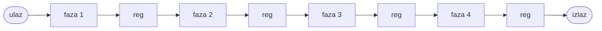

## 14. Smanjenje kašnjenja mreža primjenom pipeline tehnike

**Video:** [Smanjenje kašnjenja mreža primjenom pipeline tehnike](https://www.youtube.com/watch?v=K7ENW7DFjXg) (1:00:47) · **Kod:** [`video-tutorials/part-4/video-tutorial-14`](../../video-tutorials/part-4/video-tutorial-14) · **Vezana uputstva:** [Video tutorijali](../video-tutorials.md)

### Sadržaj

| Vrijeme | Tema |
| ---: | ------ |
| [00:15](https://www.youtube.com/watch?v=K7ENW7DFjXg&t=15s) | Kombinaciona mreža između dva registra |
| [00:39](https://www.youtube.com/watch?v=K7ENW7DFjXg&t=39s) | Podjela mreže u faze |
| [02:29](https://www.youtube.com/watch?v=K7ENW7DFjXg&t=149s) | Princip *pipeline* tehnike |
| [05:15](https://www.youtube.com/watch?v=K7ENW7DFjXg&t=315s) | Period takta i kašnjenje kroz *pipeline* |
| [07:40](https://www.youtube.com/watch?v=K7ENW7DFjXg&t=460s) | Propusnost (*throughput*) |
| [10:50](https://www.youtube.com/watch?v=K7ENW7DFjXg&t=650s) | Izbalansirana mreža: četiri puta veća propusnost |
| [13:39](https://www.youtube.com/watch?v=K7ENW7DFjXg&t=819s) | Ograničenja broja faza |
| [15:08](https://www.youtube.com/watch?v=K7ENW7DFjXg&t=908s) | Množenje pomoću produktnih članova |
| [21:30](https://www.youtube.com/watch?v=K7ENW7DFjXg&t=1290s) | Množač kao lanac faza |
| [28:00](https://www.youtube.com/watch?v=K7ENW7DFjXg&t=1680s) | Ubacivanje registara, i za operande |
| [36:31](https://www.youtube.com/watch?v=K7ENW7DFjXg&t=2191s) | VHDL opis bez *pipeline*-a |
| [43:11](https://www.youtube.com/watch?v=K7ENW7DFjXg&t=2591s) | Rezultat sinteze: oko 170 MHz |
| [45:04](https://www.youtube.com/watch?v=K7ENW7DFjXg&t=2704s) | VHDL opis sa *pipeline*-om |
| [49:14](https://www.youtube.com/watch?v=K7ENW7DFjXg&t=2954s) | Rezultat sinteze: oko 497 MHz |
| [51:20](https://www.youtube.com/watch?v=K7ENW7DFjXg&t=3080s) | Asinhroni ulazi i metastabilnost |
| [52:32](https://www.youtube.com/watch?v=K7ENW7DFjXg&t=3152s) | Sinhronizator sa dva flip-flopa |
| [57:23](https://www.youtube.com/watch?v=K7ENW7DFjXg&t=3443s) | Sinhronizatori na pinovima |
| [58:44](https://www.youtube.com/watch?v=K7ENW7DFjXg&t=3524s) | Višebitni signali i FIFO između takt domena |

### Ključni pojmovi

- **Pipeline** - podjela kombinacione mreže u faze razdvojene registrima, tako da svaka faza istovremeno obrađuje drugi podatak.
- **Faza** (*stage*) - dio mreže između dva *pipeline* registra.
- **Kašnjenje** (*latency*) - vrijeme od ulaska podatka do pojave rezultata na izlazu.
- **Propusnost** (*throughput*) - broj podataka obrađenih u jedinici vremena.
- **Izbalansiran pipeline** - faze imaju (približno) isto kašnjenje.
- **Metastabilnost** - nedefinisano stanje izlaza flip-flopa kada se ulaz promijeni u prozoru *setup*/*hold* vremena.
- **Sinhronizator** - lanac od dva ili tri flip-flopa kroz koji se asinhroni jednobitni signal uvodi u takt domen sistema.
- **Takt domen** - dio sistema koji radi sa jednim taktom.

### Objašnjenje

#### Princip

Najveća frekvencija sinhrone mreže određena je najdužom kombinacionom putanjom između dva registra ([video 13](13-timing-analysis.md)). Ako se kombinaciona mreža sa kašnjenjem `Tcomb = T1 + T2 + T3 + T4` podijeli u četiri faze i između faza ubace registri, dok jedna faza obrađuje novi podatak, sljedeća već obrađuje prethodni:



Period takta određuje najsporija faza:

```
Tmax = max(T1, T2, T3, T4)
Tc = Tcq + Tmax + Tsetup
```

| | Bez *pipeline*-a | Sa *pipeline*-om (4 faze) |
| ------ | ------ | ------ |
| Kašnjenje | `Tcomb` | `4 * Tc >= Tcomb` |
| Propusnost | `1 / Tcomb` | `k / ((3 + k) * Tc)`, za veliki `k` teži `1 / Tc` |

*Pipeline* ne smanjuje kašnjenje jednog podatka (ono je isto ili veće), nego povećava propusnost. Za izbalansiranu mrežu (`T1 = T2 = T3 = T4`) i zanemarljive `Tcq` i `Tsetup` je `Tc ≈ Tcomb / 4`, pa je propusnost četiri puta veća. Korist postoji samo kada podaci pristižu neprekidno: prazan *pipeline* se prvo puni (ovdje tri takta). Previše faza ne pomaže, jer kašnjenje faze postaje uporedivo sa `Tcq + Tsetup`, koje se ne može smanjiti.

#### Množač sa produktnim članovima

Proizvod dva petobitna broja je zbir pet produktnih članova: član `i` je `a and b(i)` pomjeren za `i` bita (proširen nulama na 10 bita). [`pipeline_mult.vhd`](../../video-tutorials/part-4/video-tutorial-14/pipeline_mult/pipeline_mult.vhd) opisuje množač kao lanac faza; u fazi `i` vektor `bv` je bit `b(i)` ponovljen pet puta, `bp` je produktni član, a `pp` međuzbir:

```vhdl
  -- stage 2
  bv2 <= (others => b1(2));
  bp2 <= unsigned("000" & (bv2 and a1) & "00");
  pp2 <= pp1 + bp2;
  a2 <= a1;
  b2 <= b1;
```

Signali `a1`, `a2`, ... (operandi u fazi) u arhitekturi `nopipe_arch` su samo preimenovani `a_reg`, ali omogućavaju da se *pipeline* uvede bez mijenjanja strukture. U `pipe_arch` se na granicama faza ubacuju registri, i za međuzbir i za operande, jer naredna faza mora da radi sa operandima istog podatka dok prva faza već prima novi:

```vhdl
  -- stage 2
  bv2 <= (others => b1_reg(2));
  bp2 <= unsigned("000" & (bv2 and a1_reg) & "00");
  pp2_next <= pp1_reg + bp2;
  a2_next <= a1_reg;
  b2_next <= b1_reg;
```

Faze 0 i 1 su spojene u jednu, pa *pipeline* ima četiri faze. Prema videu, najveća frekvencija raste sa oko 170 MHz na oko 497 MHz, uz veći broj registara. Simulacija potvrđuje da obje arhitekture daju tačan proizvod za svaki par operanada na svaki takt: `nopipe_arch` sa kašnjenjem od 2 takta (ulazni i izlazni registar), a `pipe_arch` od 5 taktova.

#### Asinhroni ulazi i sinhronizator

Signal koji se mijenja nezavisno od takta (taster, signal iz drugog uređaja) može se promijeniti u prozoru *setup*/*hold* vremena, pa flip-flop ulazi u metastabilno stanje nepoznatog trajanja. Rješenje za jednobitni signal je sinhronizator: dva (ili tri) flip-flopa u nizu, tako da metastabilno stanje prvog flip-flopa ima cijeli takt da se ustali prije nego što ga drugi upiše:

```vhdl
  process(clk, reset)
  begin
    if (reset = '1') then
      meta_reg <= '0';
      sync_reg <= '0';
    elsif rising_edge(clk) then
      meta_reg <= async_in;
      sync_reg <= meta_reg;
    end if;
  end process;
  sync_out <= sync_reg;
```

Ovaj primjer nije u folderu sa kodom. Neke FPGA komponente imaju namjenske sinhronizatore na ulaznim pinovima, koje treba aktivirati kada postoje. Višebitni signali između dva takt domena ne prenose se sinhronizatorima po bitu (biti mogu stići u različitim taktovima), nego FIFO baferom sa dva takta; takt domeni se u SDC fajlu razdvajaju naredbom `set_clock_groups`.

> **Napomena o greškama u videu:** Na [57:50](https://www.youtube.com/watch?v=K7ENW7DFjXg&t=3470s) se kaže da sinhronizatore na pinovima „treba deaktivirati” ako postoji mogućnost za to; treba ih aktivirati. Na [59:39](https://www.youtube.com/watch?v=K7ENW7DFjXg&t=3579s) se SDC naredba za razdvajanje takt domena naziva `create_group`; naredba je `set_clock_groups`.

### Primjer

[`pipeline_mult.vhd`](../../video-tutorials/part-4/video-tutorial-14/pipeline_mult/pipeline_mult.vhd) ima obje arhitekture i konfiguraciju `pipeline_mult_cfg`.

1. U *Quartus*-u prevedite dizajn sa `nopipe_arch` i `pipe_arch` i uporedite *Fmax Summary* i broj registara.
2. Napišite testbench koji na svaki takt dovodi novi par operanada i provjerava izlaz sa odgovarajućim kašnjenjem (2 odnosno 5 taktova).
3. Uklonite registre jedne faze u `pipe_arch` (koristite `a2`, `b2`, `pp2` umjesto `*_reg`/`*_next`) i ponovite mjerenje.

### Česte greške

- **Registri samo za međurezultat, bez operanada**: naredna faza računa sa operandima sljedećeg podatka.
- **Očekivanje manjeg kašnjenja**: *pipeline* povećava propusnost, a kašnjenje je isto ili veće.
- **Neizbalansirane faze**: period takta određuje najsporija faza.
- **Previše faza**: `Tcq + Tsetup` postaju dominantni.
- **Asinhroni ulaz bez sinhronizatora**: metastabilnost i povremene, teško ponovljive greške.
- **Višebitni signal kroz sinhronizator po bitu**: biti mogu stići u različitim taktovima; koristite FIFO.

### Provjera znanja

1. Šta određuje period takta u mreži sa *pipeline*-om?
2. Zašto *pipeline* ne smanjuje kašnjenje jednog podatka i šta onda poboljšava?
3. Zašto se u množaču registri ubacuju i za operande `a` i `b`, a ne samo za međuzbir?
4. Koliko taktova kasni rezultat u `pipe_arch`, a koliko u `nopipe_arch`?
5. Kako sinhronizator sa dva flip-flopa smanjuje vjerovatnoću prenošenja metastabilnog stanja?

<details>
<summary>Odgovori</summary>

1. Najsporija faza: `Tc = Tcq + max(T1, ..., Tn) + Tsetup`.
2. Podatak i dalje prolazi kroz sve faze, uz dodatno vrijeme registara; poboljšava se propusnost, jer se u svakom taktu prima novi podatak.
3. Dok naredna faza obrađuje jedan podatak, prva već prima sljedeći; registri čuvaju operande podatka koji se obrađuje u svakoj fazi.
4. 5 taktova (ulazni registar i četiri faze) u `pipe_arch`, odnosno 2 takta (ulazni i izlazni registar) u `nopipe_arch`.
5. Metastabilno stanje prvog flip-flopa ima cijeli period takta da se ustali prije nego što ga drugi flip-flop upiše; treći flip-flop dodatno smanjuje vjerovatnoću greške.

</details>

### Dodatni materijali

- Prethodni video: [13. Vremenska analiza sinhronih digitalnih sistema](https://www.youtube.com/watch?v=DVF86jV4JMo)
- Sljedeći video: [15. Primjena procedura pri pisanju testbench fajlova](https://www.youtube.com/watch?v=mw2XPHItJM8)
- Kratke teme: [Clock skew and timing analysis with clock skew](https://www.youtube.com/watch?v=VQlkn-XPkd4), [ALT_INBUF Altera primitive](https://www.youtube.com/watch?v=4kncJ8TlBzQ), [multstyle synthesis attribute](https://www.youtube.com/watch?v=yR-qmhUA1u0)
- [Video tutorijali](../video-tutorials.md) - pregled svih videa
